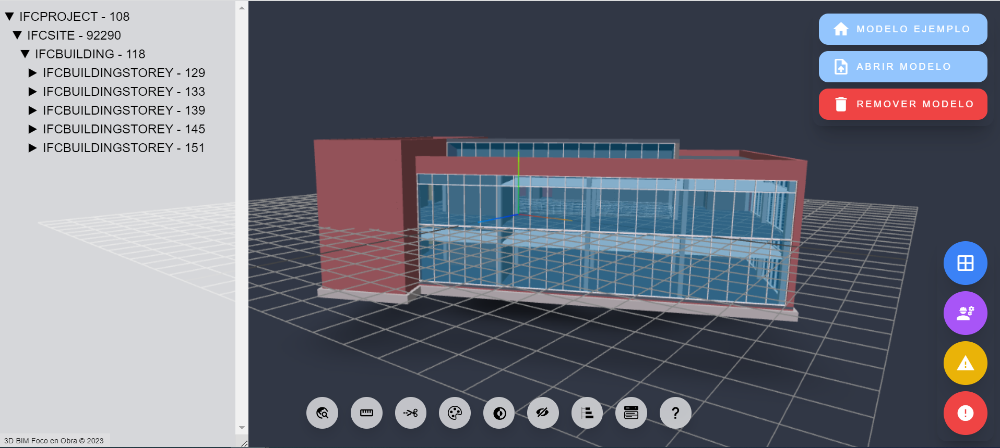

# 3D-BIM Foco en Obra

3D-BIM Foco en Obra es una herramienta IFC Viewer, desarrollada con la librería IFC.js opensource, la cual puede ser utilizada en navegadores (browser) que permite a los ingenieros BIM explorar modelos, actualmente en versión beta.




## Características clave


- Coloca tu modelo donde quieras o muévelo aleatoriamente (integración BIM-GIS)
- Selección de propiedades: conjuntos de cantidades
- Permite visualizar el modelo 3D en MapBox
- Herramienta de dimensión: medir objetos
- Herramienta de sección: cortar contenido con un plano
- Cambiar el color de fondo del espectador con una paleta de colores.
- Visión Light-Night
- Modo 3D Show-Hide
- Leer propiedades IFC haciendo clic en elementos
- Agregue planos de recorte para encontrar elementos internos.
- Preprocesamiento, gestión de memoria y soporte multihilo.

<table>
<thead>
  <tr>
    <th>Menú</th>
    <th>Categorizaciones de elementos</th>
  </tr>
</thead>
<tbody>
  <tr>
    <td> </td>
    <td>
    * Abierto<br>
    * En proceso<br>
    * Pendiente<br>
    * No conformidad<br></td>
  </tr>
</tbody>
</table>

## Cómo utilizar

Obtenga una clave API de Mapbox gratuita en [https://www.mapbox.com/](https://www.mapbox.com/)

Previamente debe tener instalado Node en https://nodejs.org/es

Almacene su API con .env y use [Live Server](https://marketplace.visualstudio.com/items?itemName=ritwickdey.LiveServer) para servir la aplicación.

```bash
# Crear la carpeta e ingresar a ella
$ mkdir foco

# Clonar el repositorio
$ git clone https://github.com/JorgeTorresV/foco3D-BIM.git

# Ingresar a la carpeta
$ cd foco3D-BIM

# Instalar dependencias
$ npm install

# Run Rollup
$ npm run build
```

## Enlaces relacionados y material de interés

#### **Web viewer IFC**

DiStellar  
https://distellar.diroots.com/

Sortdesk  
https://viewer.sortdesk.com/

BIM Model Viewer  
https://extraordinary-belekoy-ee7fa8.netlify.app/

#### **GitHub**

Ejercicios curso intensivo de IFC.js.  
https://github.com/IFCjs/ifcjs-crash-course

Ejercicios del repositorio IFC.js  
https://github.com/JorgeTorresV/ifc_3dvisor

El demo tiene como base el siguiente repositorio  
https://github.com/helenkwok/bim-gis-viewer/tree/main


#### **Videos**

IFC.js CLI: create IFC.js web app in 1 minute  
https://www.youtube.com/watch?v=ZFogdJz8Rlk

Conhecendo o IFC.js  
https://www.youtube.com/watch?v=rjDpE6QU9h4

IFC.js: aprender a programar creando aplicaciones BIM  
https://www.youtube.com/watch?v=pgeDE3BpggY

BIM 4D Animation with BlenderBIM - A quick Guide (IFC 101 - E.07)  
https://www.youtube.com/watch?v=dYGJRYunHk4&list=PLbFY94gzUJhGkxOUZknWupIiBnY5A0KUM&index=9

Dealing with Large BIM Models Using The BlenderBIM Add-on  
https://www.youtube.com/watch?v=9x9ZkEo8gng


## Créditos

Este software utiliza los siguientes paquetes de código abierto:

- [IFC.js](https://ifcjs.github.io/info/)
- [Three.js](https://threejs.org/)
- [Mapbox GL JS](https://www.mapbox.com/mapbox-gljs)
- [Node.js](https://nodejs.org/)
- [Nodemon](https://nodemon.io/)
- [Dexie.js](https://dexie.org/)
- [Rollup](https://rollupjs.org/guide/en/)
- [Dotenv](https://dotenv.org/)